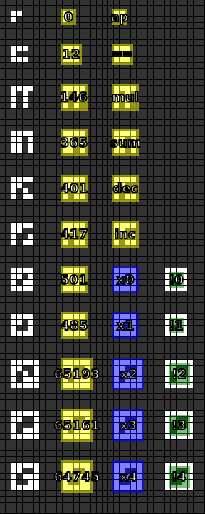

Appendix
========

.. note::

   If you have any ideas or enhancements for this page, please `edit it on GitHub`_!

Dictionary
----------

This is the the dictionary of all received special symbols from messages #1 to #9.

Each row is one symbol. Columns are:

- raw image
- annotated with numerical code
- annotated with current interpretation
- additional notes

.. _edit it on GitHub: https://github.com/zaitsev85/message-from-space/blob/master/source/message2.rst
