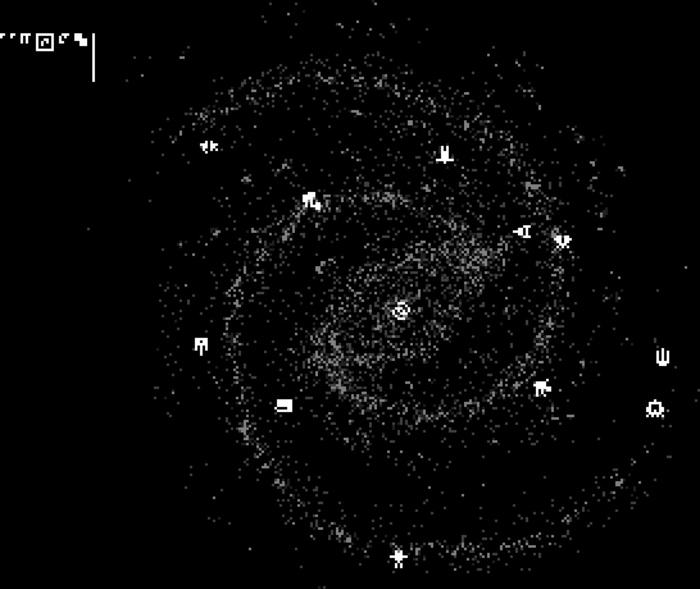
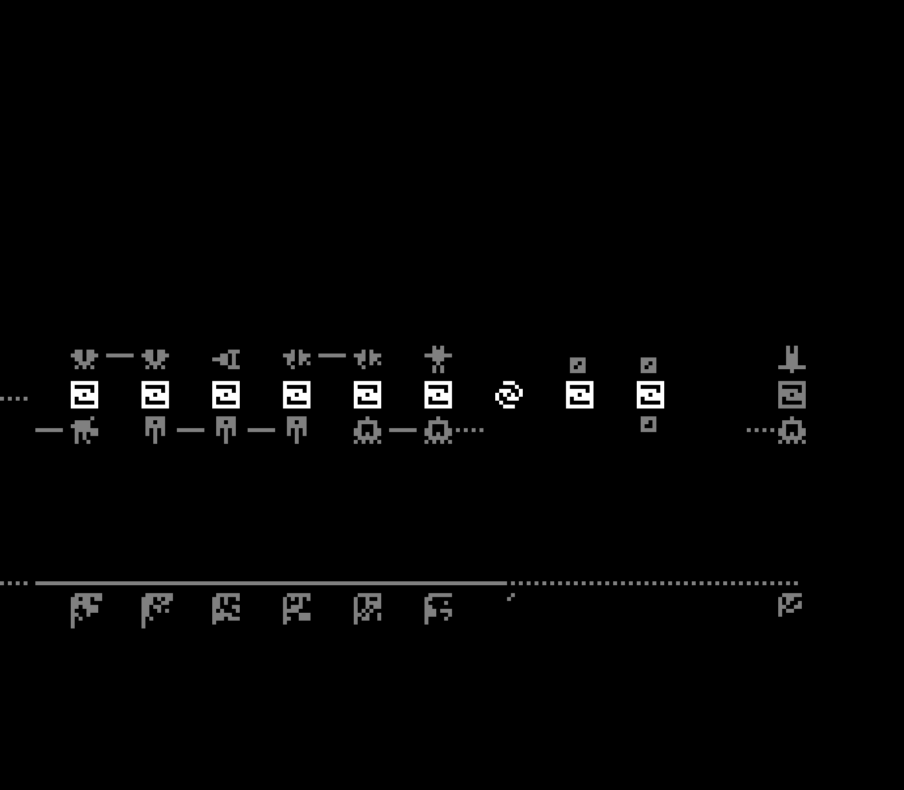
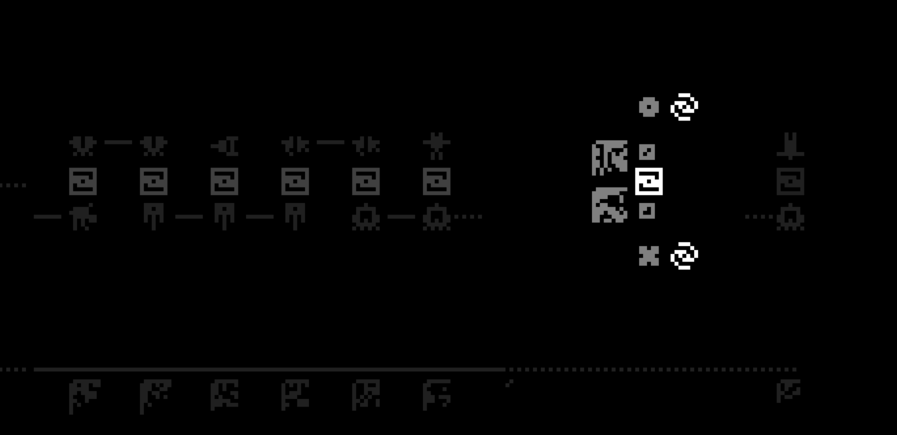

Final Tournament
================

What We Know So Far
-------------------

We continued to explore our “galaxy evaluator” and here’s the summary of our findings.

We were demonstrated a historical perspective of lots of civilisations (including us!) spread throughout our Galaxy.

We saw an intergalactic tournament among the civilisations that lasts for ages.

The numbers at the bottom of this screen indicate that on July 20 at 13:00 UTC (a wild guess!) there will be
the final battle between an alien race and the humankind. What happens if the humankind loses? We don’t know (yet).

We could also watch the “replays” of the past battles.
Then we were able to explore what looks like a series of “tutorial levels” demonstrating the basic concepts of space combat.
No doubt we can use these materials to learn how to fight.

We were able to explore what a “battle” is. One (or many) “ships” seem to “orbit” a strange square “planet”.

.. image:: game-planet.png

Also, these “ships” bear one of two responsibilities: they are either “attacking ships” or “defending ships”.
In order to win a “battle”, “attackers” have to destroy other ships in a fixed number of “turns”.
Unlike “attackers”, “defenders” win a “battle” if they are not destroyed in a fixed number of “turns”.
Note that we don’t know if a “draw” is a possible result of a “battle”.

Although we were unable to explore all “tutorial levels” and get through them, we’ve made further progress.
We noticed that the “states” (see the :doc:`message #42<message42>`) of the “evaluator” are nearly identical after every “battle” that we have explored.
The only difference is that a single number keeps incrementing. We’ve tried our luck and put a larger number in there—and that was the right move.

We believe that we’ve managed to enter the “multiplayer mode” which can be used to fight other players. To find the best candidate to fight for the
humankind in the final battle, we are going to set up our own local tournament using this “multiplayer mode”. We will accept submissions for this
tournament before the final battle countdown ends.

How to Play the Local Tournament
--------------------------------

This section describes the way we run your submitted code on our server.
Your submission can play games using its internal Galaxy Pad UI instance or, alternatively, via direct proxy calls.

We run some preparation steps for you, so you don't have to do it:

1. In our internal Galaxy Pad instance we create a new game and generate player keys for both attacker and defender. First, we click on the two-player game button:

   .. image:: game-menu.png

   Then, click on the Galaxy button:

   .. image:: game-create.png
   
2. We run your submission container with ``serverUrl`` and ``playerKey`` as command line arguments. Note that you **must** use provided ``serverUrl`` as a base URL for all outgoing ``aliens/send`` requests to alien proxy.
   For example, ``serverUrl`` can be ``http://server:12345``. In this case you should send requests to ``http://server:12345/aliens/send``.
   
3. Your bot **must** join the game using the provided ``playerKey``. Your bot can create its own internal Galaxy Pad instance and do it via the UI. First, click on the two-player game button:

   .. image:: game-menu.png

   Then, click on the Player Key button on the left and input player key pixel by pixel (you can hack the state to avoid manual input):

   .. image:: game-join.png

   Then, click on the top-left Player Key button to confirm joining the game.

   Alternatively your bot can do it without the Galaxy Pad using our HTTP proxy directly via ``JOIN`` request (see below).
   
4. Your bot **must** choose your initial ship parameters and start playing after successfuly joining.
   Your bot can do it via your internal Galaxy Pad UI:

   .. image:: game-start.png

   Then, click on the Galaxy button to start the game.

   Alternatively your bot can do it without the Galaxy Pad using our HTTP proxy directly via ``START`` request (see below).

5. Your bot **must** issue commands for your ships until the game is finished.
   Your bot can do it via your internal Galaxy Pad UI as you did in the tutorials:

   .. image:: game-commands.png

   Clicking on the Galaxy button sends all your selected commands to the alien proxy.
   
   Alternatively your bot can do it without the Galaxy Pad using our HTTP proxy directly via ``COMMANDS`` request (see below).

Timeouts
--------

Each action required from your bot **must** be done fast enough, or we will disconnect it from the game and give the victory to your opponent.

- ``JOIN``: you should send it within **10 seconds** after we run your ``run.sh``.
- ``START``: you should send it within **1 second** after you receive the response to ``JOIN``.
- ``COMMANDS``: you should send it within **1 second** after you receive the response to previous ``START`` or ``COMMANDS``.

Also you have a timeout for the entire game (all ``COMMAND``\ s, but not ``JOIN`` and ``START``): **1 minute** total.
We know that a game runs for a maximum of **256** turns, so it's up to you how to use this time.  

Implementation Issues
---------------------

Of course, you can just run your Galaxy Pad and emulate clicks on it.

But we also have partially reverse-engineered the protocol so you can use this knowledge to send requests to the Alien Proxy directly,
without running your Galaxy Pad at all.

Here is a pseudo code:

::

    main (args)
    {
        // parse command line arguments
        serverUrl = args[0]
        playerKey = args[1]

        // make valid JOIN request using the provided playerKey
        joinRequest = makeJoinRequest(playerKey)

        // send it to aliens and get the GameResponse
        gameResponse = send(serverUrl, joinRequest)

        // make valid START request using the provided playerKey and gameResponse returned from JOIN
        startRequest = makeStartRequest(playerKey, gameResponse)
    
        // send it to aliens and get the updated GameResponse
        gameResponse = send(serverUrl, startRequest)

        while (true) // todo: you MAY detect somehow that game is finished using gameResponse
        {
            // make valid COMMANDS request using the provided playerKey and gameResponse returned from START or previous COMMANDS
            commandsRequest = makeCommandsRequest(playerKey, gameResponse)

            // send it to aliens and get the updated GameResponse
            gameResponse = send(serverUrl, commandsRequest)
        }
    }

JOIN
----

::

    (2, playerKey, (...unknown list...))
  
Purpose of the third item of this list is still unclear for us and we saw only 
empty list (``nil``) here. Maybe you will discover more and use it... 

START
-----

::

    (3, playerKey, (<number1>, <number2>, <number3>, <number4>))

The third item of this list is always a list of 4 numbers – it's the initial ship parameters.

COMMANDS
--------

::

    (4, playerKey, (... ship commands? ...))

The third item of this list obviously contains commands for your ships. We still can't
understand them, but if you pass an empty list here (``nil``), your ships will continue
moving without any commands applied.

GameResponse
------------

::

    (1, GAME_STAGE, (...unknown list A...), (...state of the game?...))

- ``1`` – always ``1``. Just indicates success?
- ``GAME_STAGE``:
    - ``0`` – indicates that the game has not started yet
    - ``1`` – indicates that the game has already started
    - ``2`` – indicates that the game has finished
- ``(...unknown list A...)`` – still unclear but it doesn't change from turn to turn during the whole game
- ``(...state of the game?...)`` – it changes from turn to turn. Obviously it's about state of the game, but the details are still unclear too

Scoring
-------

Local tournament consists of several stages. Each stage has a hard deadline:

1. 24 hours before the Alien Deadline (not scored, see below)
2. 18 hours before the Alien Deadline
3. 12 hours before the Alien Deadline
4. 9 hours before the Alien Deadline
5. 6 hours before the Alien Deadline
6. 4 hours before the Alien Deadline
7. 2 hours before the Alien Deadline (leaderboard frozen)
8. Alien Deadline (July 20 at 13:00 UTC)

Teams submit their solutions as described in the `submission system documentation`_.
A team must select **only one** built and tested submission as their **active** submission selected for rating games.
This choice is made via the `Submissions page`_ (click on a row to select).
Note that new commits **do not** automatically become active unless there is a ``#release`` word in the commit message.

Before letting team's submission participate in the tournament our system will test the submission's ability to join and start
a game as an attacker and as a defender. It means that vanilla starter kits are **no longer considered valid submissions**.

At the end of each stage our system will stop accepting new submissions for that stage.
It means that your **active** submission at the end of the stage becomes your **final** submission for that stage.

Our tournament system uses `TrueSkill rating system`_ to pair opponents and rank submissions in each stage.
After the end of each stage our system will run additional rounds of games until all the TrueSkill ratings settle.
Then we will assign score to top 50 submissions according to a formula:

.. math::

   score = \lfloor 50^{(50-rank)/50} \rfloor

... where ``rank`` is zero-based position in the leaderboard for this stage.

**Total score** for a team is the sum of the scores of that team **for stages 2..8**.
The first stage earns no score and serves to make you familiar with the system.

After the final Alien Deadline we will stop accepting new submissions entirely. Then we will run an **additional tournament stage**
between the top 20 teams ranked by the **total score**. **Final submissions** from the last stage will be used in this additional stage.
Winners of this additional stage will fight against the aliens for the honor of the humankind. And declared as winners of the ICFP Contest 2020.

Results of this additional stage and the whole contest will be made public at the ICFP 2020 in August 2020.

.. _`submission system documentation`: https://github.com/icfpcontest2020/dockerfiles/blob/master/README.md
.. _`Submissions page`: https://icfpcontest2020.github.io/#/submissions
.. _`TrueSkill rating system`: https://en.wikipedia.org/wiki/TrueSkill
