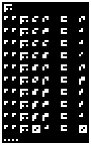
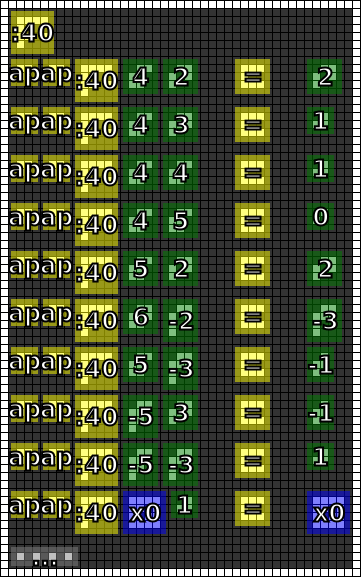

#10. Integer Division
=====================

.. note::

   If you have any ideas or enhancements for this page, please `edit it on GitHub`_!

Image
-----

This image was produced from the tenth radio transmission using :doc:`previously contributed code <radio-transmission-recording>`.

This partly annotated version of the image was made using :ref:`code from message #3 <message3-code>`.

Interpretation
--------------

The new operator is consistent with integer division which rounds toward zero.

Decoded
-------

.. literalinclude:: message10-decoded.txt

Code
----

The :ref:`Haskell code <message3-code>` has been revised to decode the integer devision operator.

.. literalinclude:: annotate10.hs.diff
   :language: diff

Example output:

The full source code:

.. literalinclude:: annotate10.hs
   :language: haskell

Once again, I encourage you to join our `chat server`_ to combine efforts and crack this message.

.. _edit it on GitHub: https://github.com/zaitsev85/message-from-space/blob/master/source/message10.rst
.. _chat server: https://discord.gg/xvMJbas
