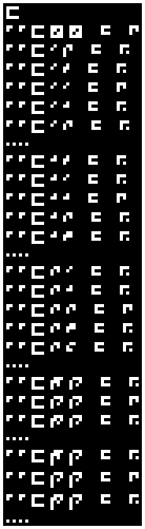
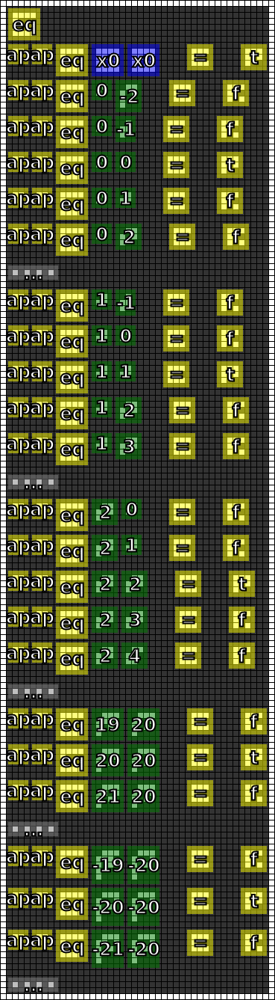

#11. Equality and Booleans
==========================

.. include:: note.rst

.. _edit it on GitHub: https://github.com/zaitsev85/message-from-space/blob/master/source/message11.rst

Image
-----

This image was produced from the eleventh radio transmission using :doc:`previously contributed code <radio-transmission-recording>`.

This partly annotated version of the image was made using :ref:`code from message #3 <message3-code>`.

Interpretation
--------------

Operator 448 is consistent with checking whether the first number equal than the second number. We will denote it as `eq`.

Operator 2 is consistent with `true` and operator 8 is consistent with `false`.

Decoded
-------

.. literalinclude:: message11-decoded.txt

Code
----

The :ref:`Haskell code <message3-code>` has been revised to decode new glyphs.

Example output:

