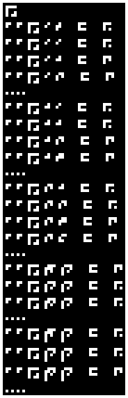
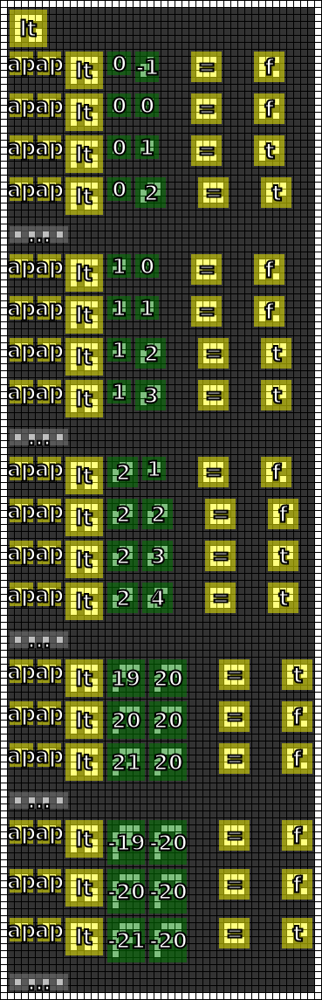

#12. Less Than
========

.. note::

   If you have any ideas or enhancements for this page, please `edit it on GitHub`_!

Image
-----

This image was produced from the twelfth radio transmission using :doc:`previously contributed code <radio-transmission-recording>`.

This partly annotated version of the image was made using :ref:`code from message #3 <message3-code>`.

Interpretation
--------------

.. todo::

   The new operator is consistent with the *less than* operator (excluding equality).

Decoded
-------

.. literalinclude:: message12-decoded.txt

Code
----

.. todo::

   Revise the :ref:`Haskell code <message3-code>` to support new glyphs from the twelfth message.

Once again, I encourage you to join our `chat server`_ to combine efforts and crack this message.

.. _edit it on GitHub: https://github.com/zaitsev85/message-from-space/blob/master/source/message12.rst
.. _chat server: https://discord.gg/xvMJbas
