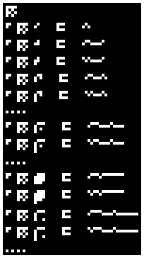
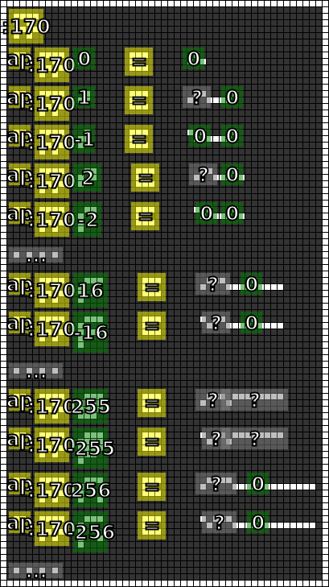
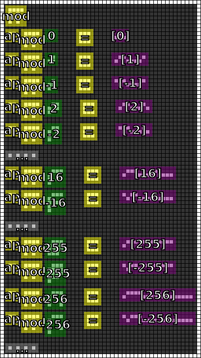

#13. Modulate
=============

.. include:: note.rst

.. _edit it on GitHub: https://github.com/zaitsev85/message-from-space/blob/master/source/message13.rst

Image
-----

This image was produced from the thirteenth radio transmission using :doc:`previously contributed code <radio-transmission-recording>`.

This partly annotated version of the image was made using :ref:`code from message #3 <message3-code>`.

Interpretation
--------------

The operator defined in this message, ``mod``, is for converting numbers from a grid form into a linear-encoded form. The linear encoding appears to be a type of `Variable-length encoding`_, with the following form:

* Bits 0..1 define a positive or negative number (and signal width) via a high/low or low/high signal change:

  * 01: positive number
  * 10: negative number
     
* Bits 2..(n+2) define the width of the following binary-encoded number via a unary-encoded number of length *n* composed of high signals ending with a low signal. The number width (in bits) is four times the unary encoding (i.e. 4 * *n*):

  * 0: 0 [i.e. the number zero]
  * 10: 4-bit number [i.e. 1-7]
  * 110: 8-bit number [i.e. 1-255]
  * 1110: 12-bit number [i.e. 1-4095]
  * ...
     
* The remaining bits, i.e. (n + 3)..(n + 3 + 4*n - 1), determine the number itself, in most-significant-bit first binary notation. Using the examples from this message:

  * 0001: 1
  * 00010000: 16
  * 000100000000: 256
  * ...

With this encoding, the number zero only requires three bits (i.e. 010), but arbitrarily large numbers can also be represented.

.. _Variable-length encoding: https://en.wikipedia.org/wiki/Variable-length_quantity

Decoded
-------

.. literalinclude:: message13-decoded.txt

Code
----

The :ref:`Haskell code <message3-code>` has been revised to decode new glyphs.

Example output:

