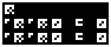
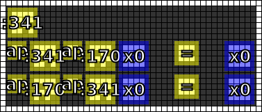

#14. Linear-to-grid
========

.. include:: note.rst

.. _edit it on GitHub: https://github.com/zaitsev85/message-from-space/blob/master/source/message14.rst

Image
-----

This image was produced from the fourteenth radio transmission using :doc:`previously contributed code <radio-transmission-recording>`.

This partly annotated version of the image was made using :ref:`code from message #3 <message3-code>`.

Interpretation
--------------

.. todo::

   This appears to define an inverse operator to that from image 13, demonstrating that :170 is the inverse of :341, and vice versa. This suggests that :341, when applied to a linear-encoded number, will create a grid-encoded number.

Decoded
-------

.. literalinclude:: message14-decoded.txt

Code
----

.. todo::

   Revise the :ref:`Haskell code <message3-code>` to support new glyphs from the fourteenth message.
