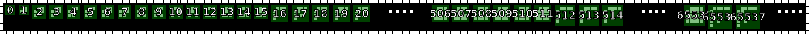

Message #2
==========

.. note::

   If you have any ideas or enhancements for this page, please `edit it on GitHub`_!

Following documentation is a cooperative result combined from our `Discord chat`_ and numerous pull requests.
Thanks to everyone who helped!

Image
-----

This image was produced from the second radio transmission using :doc:`previously contributed code <radio-transmission-recording>`.

Interpretation
--------------

Contributed by Discord user @elventian.

We have enough data to conclude that we've found the way of encoding natural numbers by raster monochrome pictogram framed at the top and left.
There is a square semantic region with side N inside the pictogram. Each pixel of the region corresponds to one bit in the binary notation of the number.
Let x and y be column and row numbers in the range [0 ... N), then the place value for the cell (x, y) is determined by the following formula:

.. math::
   place\_value(x,y) = 2^{y * N + x}

Place values for N up to 5:

.. image:: message2-encoding1.png
   :width: 1281px

Decoded
-------

Decoded by Discord users @gltronred and @frictionless.

``0 1 2 3 4 5 6 7 8 9 10 11 12 13 14 15 16 17 18 19 20 ...``
``506 507 508 509 510 511 512 513 514 ...``
``65535 65536 65537 ...``

.. _message2-code:

Code
----

This Python code decodes and annotates numbers on a provided picture.

Contributed by Discord user @pink_snow.

Example output:

.. literalinclude:: annotate.py
   :language: python

.. _edit it on GitHub: https://github.com/zaitsev85/message-from-space/blob/master/source/message2.rst
.. _Discord chat: https://discord.gg/xvMJbas
