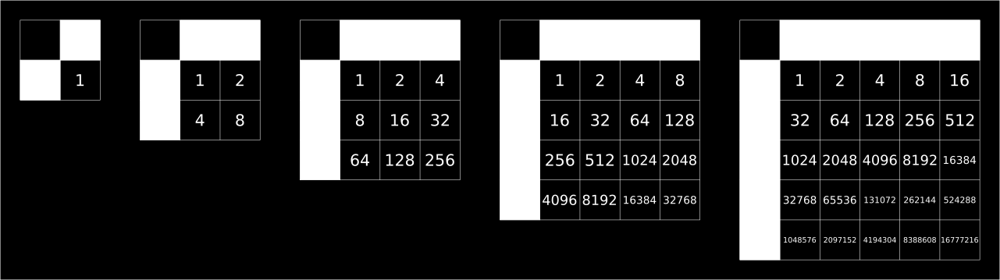

Message #2
==========

.. note::

   If you have any ideas or enhancements for this page, please `edit it on GitHub`_!

Image
-----

This image was produced from the second radio transmission using :doc:`previously contributed code <radio-transmission-recording>`.

.. image:: message2.png

Interpretation
--------------

We have enough data to conclude that we've found the way of encoding natural numbers by raster monochrome pictogram framed at the top and left.
There is a square semantic region with side N inside the pictogram. Each pixel of the region corresponds to one bit in the binary notation of the number.
Let x and y be column and row numbers in the range [0 ... N), then the place value for the cell (x, y) is determined by the following formula:

.. math::
   place\_value(x,y) = 2^{y * N + x}

Place values for N up to 5:

Once again, I encourage you to join our `chat server`_ to combine efforts and crack this message.

.. _edit it on GitHub: https://github.com/zaitsev85/message-from-space/blob/master/source/message2.rst
.. _chat server: https://discord.gg/xvMJbas
