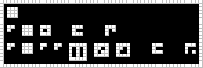
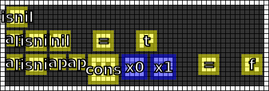

#29. ???
========

.. include:: note-discord.rst

.. _edit it on GitHub: https://github.com/zaitsev85/message-from-space/blob/master/source/message29.rst

Image
-----

This image was produced from the twenty-ninth radio transmission using :doc:`previously contributed code <radio-transmission-recording>`.

This partly annotated version of the image was made using :ref:`code from message #3 <message3-code>`.

Interpretation
--------------

.. include:: message29-condensed.txt

Decoded
-------

.. literalinclude:: message29-decoded.txt
