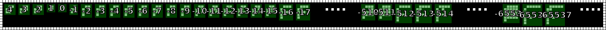

Message #3
==========

.. note::

   If you have any ideas or enhancements for this page, please `edit it on GitHub`_!

Following documentation is a cooperative result combined from our `Discord chat`_ and numerous pull requests.
Thanks to everyone who helped!

Image
-----

This image was produced from the third radio transmission using :doc:`previously contributed code <radio-transmission-recording>`.

This partly annotated version of the image was made using :ref:`code from message #2 <message2-code>`.

.. image:: message3-annotated.svg

Interpretation
--------------

Contributed by Discord user @pink_snow.

Looks like the bottom left additional pixel is used to indicate negative numbers.

Decoded
-------

``4 3 2 1 0 -1 -2 -3 -4 -5 -6 -7 -8 -9 -10 -11 -12 -13 -14 -15 -16 -17 ...``
``-510 -511 -512 -513 -514 ...``
``-65535 -65536 -65537 ...``

.. _message3-code:

Code
----

Revised version of the Python code that supports negative numbers is published on the :ref:`message #2 page <message2-code>`.

Contributed by Discord user @pink_snow.

Example output:

@pink_snow also provided a Haskell version of the same code.

.. literalinclude:: annotate.hs
   :language: haskell

.. _edit it on GitHub: https://github.com/zaitsev85/message-from-space/blob/master/source/message3.rst
.. _Discord chat: https://discord.gg/xvMJbas
