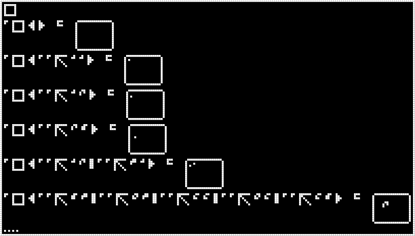

#32. draw
=========

.. include:: note-discord.rst

.. _edit it on GitHub: https://github.com/zaitsev85/message-from-space/blob/master/source/message32.rst

Image
-----

This image was produced from the thirty-second radio transmission using :doc:`previously contributed code <radio-transmission-recording>`.

Interpretation
--------------

.. include:: message32-condensed.txt

Decoded
-------

.. literalinclude:: message32-decoded.txt
