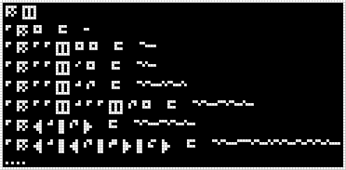

#35. Modulate List
==================

.. include:: note-discord.rst

.. _edit it on GitHub: https://github.com/zaitsev85/message-from-space/blob/master/source/message35.rst

Image
-----

This image was produced from the thirty-fifth radio transmission using :doc:`previously contributed code <radio-transmission-recording>`.

Interpretation
--------------

List modulation is an additional encoding of modulated numbers, where the first two bits are used for determining whether to open or close a list. It appears like encoding a list uses `11 <number> 11 <number> 11 ... 00`, i.e. `11` as a prefix for every element, finishing off the list with a `00`. A null list is defined as `00`, and a list containing a single zero element is encoded as `11 010 00`. Additional list depths are created by adding additional `11` elements, i.e. `11 11 11 010 00 00 00` should describe a list of a list of a list containing 0 (i.e. [[[0]]]).

Note: this is not a full description, beause it doesn't explain the construct on line 2, `11 00 00`.

.. include:: message35-condensed.txt

Decoded
-------

.. literalinclude:: message35-decoded.txt
