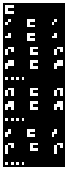
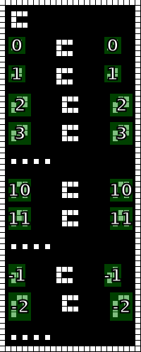
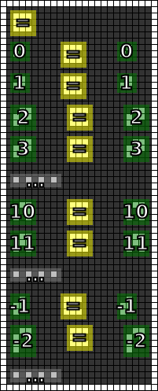

#4. Equality
============

.. include:: note.rst

.. _edit it on GitHub: https://github.com/zaitsev85/message-from-space/blob/master/source/message4.rst

Image
-----

This image was produced from the fourth radio transmission using :doc:`previously contributed code <radio-transmission-recording>`.

This partly annotated version of the image was made using :ref:`code from message #2 <message2-code>`.

Interpretation
--------------

The new glyph is probably an equality sign, but there is not enough information be sure.
Can be a less-than sign, any operation that preserves its operand, etc.

Decoded
-------

.. literalinclude:: message4-decoded.txt

Code
----

Revised version of the Haskell code that supports the ``=`` glyph is published on the :ref:`message #3 page <message3-code>`.

Contributed by Discord user @pink_snow.

Example output:

