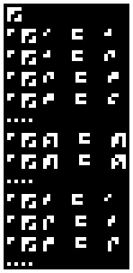
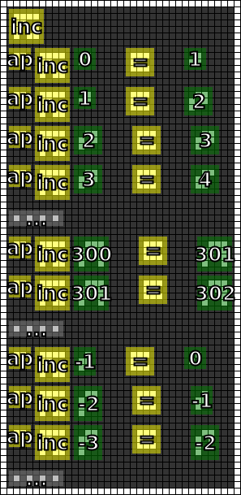
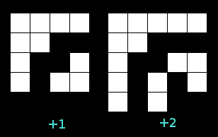
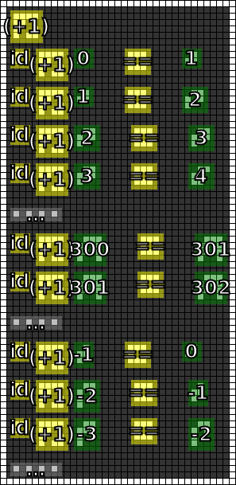

#5. Successor
=============

.. note::

   If you have any ideas or enhancements for this page, please `edit it on GitHub`_!

Following documentation is a cooperative result combined from our `Discord chat`_ and numerous pull requests.
Thanks to everyone who helped!

Image
-----

This image was produced from the fifth radio transmission using :doc:`previously contributed code <radio-transmission-recording>`.

This partly annotated version of the image was made using :ref:`code from message #3 <message3-code>`.

Interpretation
--------------

There are two new symbols in this message, which are used inseparably from each other.
It seems that a combination of them represents an increment operation.

The three-pixel symbol could be the application operator, and the other complicated one is the successor function. (by @nore)

The inner part of the complicated symbol is number 1. (by @gltronred)
As a consequence of this observation, this symbol could contain any number: (image by @elventian)

The numerical value of new symbols are 0 and 417.

Decoded
-------

.. literalinclude:: message5-decoded.txt

Code
----

Revised version of the Haskell code that supports the ``ap`` and ``inc`` glyphs is published on the :ref:`message #3 page <message3-code>`.

Contributed by Discord users @pink_snow and @fryguybob.

Example output:

.. _edit it on GitHub: https://github.com/zaitsev85/message-from-space/blob/master/source/message4.rst
.. _Discord chat: https://discord.gg/xvMJbas
