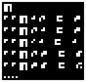
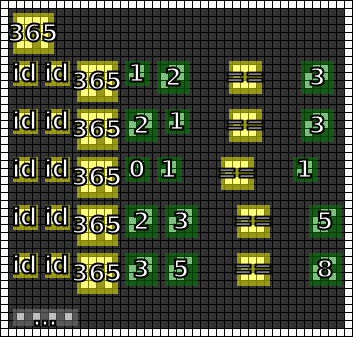
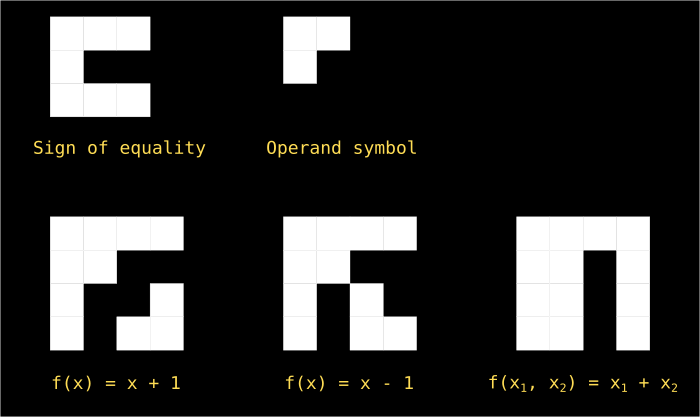
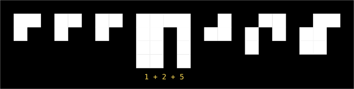

Message #7
==========

.. note::

   If you have any ideas or enhancements for this page, please `edit it on GitHub`_!

Image
-----

This image was produced from the seventh radio transmission using :doc:`previously contributed code <radio-transmission-recording>`.

This partly annotated version of the image was made using :ref:`code from message #3 <message3-code>`.

Interpretation
--------------

This image shows all known operators and functions

Count of operand symbols before function symbol defines how many operands the function expects.
if this is correct, we need to do the following to calculate sum of three numbers:

Decoded
-------

.. todo::

   Decode the seventh message.

Code
----

.. todo::

   Revise the :ref:`Haskell code <message3-code>` to support new glyphs from the seventh message.

Once again, I encourage you to join our `chat server`_ to combine efforts and crack this message.

.. _edit it on GitHub: https://github.com/zaitsev85/message-from-space/blob/master/source/message7.rst
.. _chat server: https://discord.gg/xvMJbas
