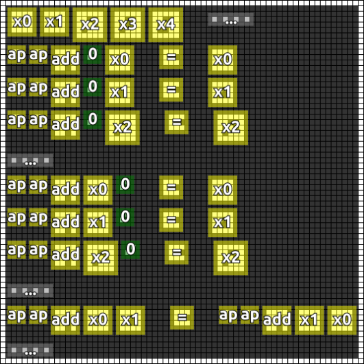

#8. Variables
=======

.. note::

   If you have any ideas or enhancements for this page, please `edit it on GitHub`_!

   Following documentation is a cooperative result combined from our Discord chat and numerous pull requests. Thanks to everyone who helped!

Image
-----

This image was produced from the eighth radio transmission using :doc:`previously contributed code <radio-transmission-recording>`.

.. image:: message8.png
   :width: 268px

This annotated version of the image was made using :ref:`code from message #3 <message3-code>`.

Interpretation
--------------

Appears to designate a syntax for declaring variables.

Variables have a border of high values framing a negative of numbers as previously encoded in message #1.

Decoded
-------

.. literalinclude:: message8-decoded.txt

Code
----

.. todo::

   Revise the :ref:`Haskell code <message3-code>` to support new glyphs from the eighth message. (appears to be done by @pink_snow but has not yet been updated in a PR)

Once again, I encourage you to join our `chat server`_ to combine efforts and crack this message.

.. _edit it on GitHub: https://github.com/zaitsev85/message-from-space/blob/master/source/message8.rst
.. _chat server: https://discord.gg/xvMJbas
