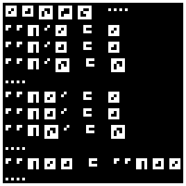
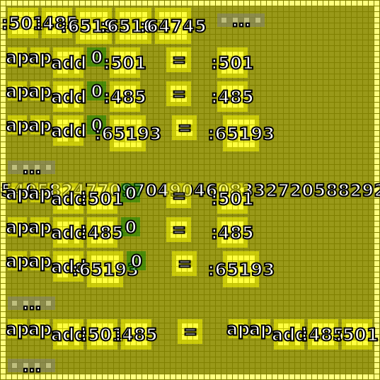
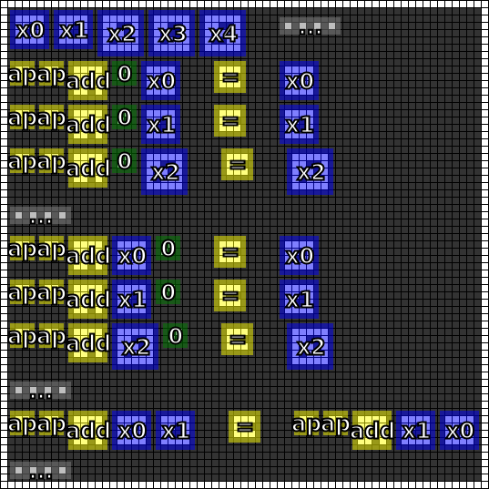

#8. Variables
=============

.. include:: note.rst

.. _edit it on GitHub: https://github.com/zaitsev85/message-from-space/blob/master/source/message8.rst

Image
-----

This image was produced from the eighth radio transmission using :doc:`previously contributed code <radio-transmission-recording>`.

This partly annotated version of the image was made using :ref:`code from message #3 <message3-code>`.

Interpretation
--------------

Contributed by Discord user @FiddlesticksMcGee.

Appears to designate a syntax for declaring variables.

Variables have a border of high values framing a negative of numbers as previously encoded in :doc:`radio-transmission-recording`.

Decoded
-------

.. literalinclude:: message8-decoded.txt

Code
----

Revised version of the Haskell code that supports the variable glyphs is published on the :ref:`message #3 page <message3-code>`.

Contributed by Discord users @pink_snow and @fryguybob.

Example output:

