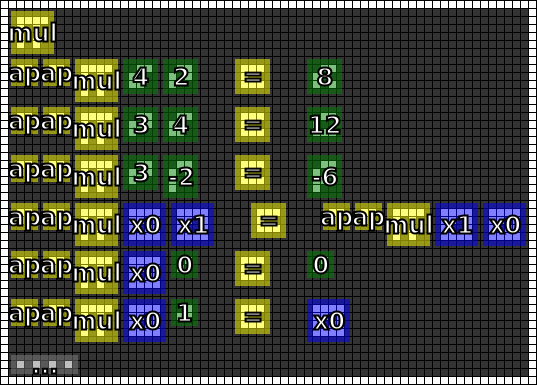

#9. Product
===========

.. include:: note.rst

.. _edit it on GitHub: https://github.com/zaitsev85/message-from-space/blob/master/source/message9.rst

Image
-----

This image was produced from the ninth radio transmission using :doc:`previously contributed code <radio-transmission-recording>`.

.. image:: message9.png
   :width: 268px

This partly annotated version of the image was made using :ref:`code from message #3 <message3-code>`.

.. image:: message9-annotated.svg
   :width: 268px

Interpretation
--------------

Definition of the new glyph is consistent with the definition of multiplication.

Decoded
-------

.. literalinclude:: message9-decoded.txt

Code
----

Revised version of the Haskell code that supports the ``mul`` glyph is published on the :ref:`message #3 page <message3-code>`.

Contributed by Discord users @pink_snow and @fryguybob.

Example output:

