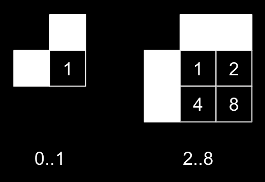

Message #1
==========

.. note::

   If you have any ideas or enhancements for this page, please `edit it on GitHub`_!

:download:`Download <radio-transmission-recording.wav>` radio transmission recording.
It was originally received at ~5 GHz and scaled down to ~500 Hz to make signal audible for humans.

Following documentation is a cooperative result combined from our `Discord chat`_ and numerous pull requests.
Thanks to everyone who helped!

Spectrogram
-----------

Spectrogram of the recording, rendered with a `notebook`_ by Discord user @nya:

.. image:: radio-transmission-spectrogram.png

Image
-----

A 2D image created by:

1. Converting low and high frequency spans into black and white squares respectively.
2. Rearranging these squares into a rectangle instead of a single line.

Contributed by Discord user @elventian.

.. image:: radio-transmission-2d.png
   :width: 240px

Interpretation
--------------

Based on the discussions with Discord users @nya, @Kilew, @fryguybob, @aaaa1, @gltronred and @elventian.

Probably the symbols on the left represent numbers and the number of elements on the right is the unary representation of this number.

Symbols on the left look like a binary encoding that should work for numbers 1..15. Picture says 8, because we have hard data only up to 8:

According to this theory we can speculate that the numbers 9..15 would be represented with these symbols:

.. image:: numbers-encoding2.png
   :width: 420px

Based on this logic the symbols could be extended further like this:

.. image:: numbers-encoding4.png
   :width: 560px

:doc:`Second transmission <message2>` seems to support the second conjecture (right picture).

Code
-----------

This Rust code generates decoded images similar to the image included above from WAV files.

Contributed by Discord user @aaaa1.

Example output:

.. image:: rust-generated-decoded-image.png
   :width: 100px

.. literalinclude:: decode-wav.rs
   :language: rust

.. _edit it on GitHub: https://github.com/zaitsev85/message-from-space/blob/master/source/radio-transmission-recording.rst
.. _notebook: https://gist.github.com/nya3jp/5094571c5905783327f35e8df207c8ad#file-spectrogram-ipynb
.. _Discord chat: https://discord.gg/xvMJbas
